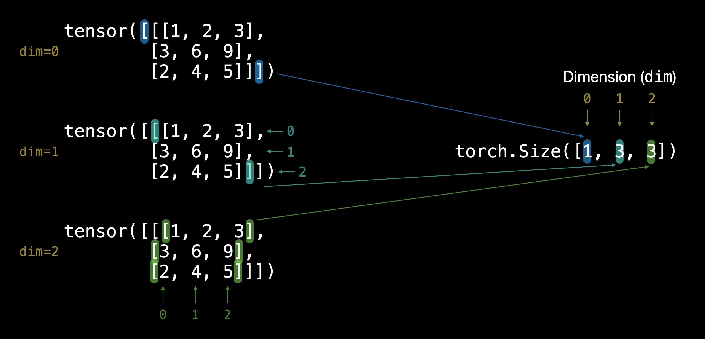

# PyTorch Tensors

https://pytorch.org/docs/stable/tensors.html

- Multi-dimensional matrix
- Only contains a single data type
  - floating point, integer (signed/unsigned), boolean, complex, quantized
- There are `CPU` as well as `GPU` tensors

## Operations
- Can be created from Python list or Numpy arrays
- Can be indexed like Python lists
- Operations can be inplace or create new tensors

## Dimensions

```python

TENSOR = torch.tensor([[[1, 2, 3],
                        [3, 6, 9],
                        [2, 4, 5]]])
```

 
